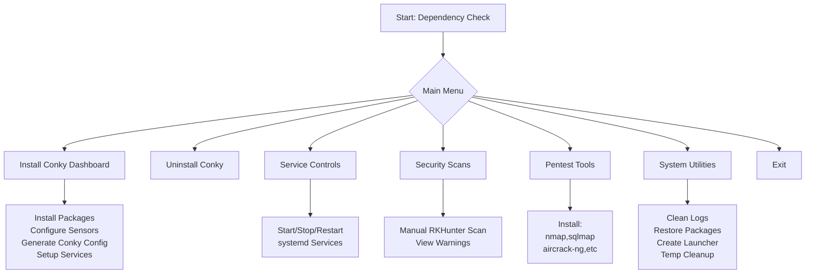

# Conky Cybersecurity Monitor  
**Automate the installation, configuration, and management of Conky as a cybersecurity dashboard on Linux**  

---

##  Overview  
Transform your Linux desktop into a real-time cybersecurity monitoring station with this comprehensive dialog-driven interface. The script integrates security tools, hardware sensors, and pentesting utilities into a sleek Conky dashboard.

---

##  Requirements  
| **Component**       | **Details**                                      |
|---------------------|--------------------------------------------------|
| **Distributions**   | Ubuntu/Debian (18.04+ recommended)              |
| **Privileges**      | Sudo access required                            |
| **Dependencies**    | `dialog`, `conky`, `curl`, `rkhunter`, `lm-sensors`, `nmap`, `upower` |

---

##  Installation  
```bash
wget https://raw.githubusercontent.com/jose-litium/conky-cybersecurity-monitor/main/conky_cybersecurity_monitor.sh
chmod +x conky_cybersecurity_monitor.sh
./conky_cybersecurity_monitor.sh
```

> **Note**: Run as regular user (not root). Sudo password required for setup.

---

##  Key Features  
- **Automated Dashboard Setup**: Conky + RKHunter + sensors  
- **Pentesting Toolkit**: One-click install:  
  ```nmap, sqlmap, aircrack-ng, hydra, john, metasploit, wireshark```  
- **System Monitoring**: CPU/RAM/disk/temp/network/logs  
- **Security Operations**:  
  - Rootkit scanning (manual/auto)  
  - Log cleaning & system restoration  
  - Desktop launcher creation  
- **Service Management**: systemd integration (user/system)  

---
## Looks of the final version


*Visual dialog interface with color-coded options*
---
## 🖥Interactive Menu


*Visual dialog interface with color-coded options*


---

## Configuration  
**Conky Config**: `~/.config/conky/conky.conf`  
**Helper Scripts**: `~/.local/conky_app/`  
**Customize**: Colors, layout, and monitored metrics via config file  

---

## Security Design  
- Minimal sudo permissions via `/etc/sudoers.d/conky`  
- All operations require explicit confirmation  
- Audit logs: `/tmp/conky_gui.log`  
- RKHunter warnings: `/tmp/rkhunter_warnings.txt`  

---

##  System Flow  


---

##  Uninstallation  
Run script → Select **"Uninstall Conky"** → Complete removal of:  
- Config files  
- Services  
- Sudo permissions  
- Helper scripts  

---

##  Credits  
**Author**: jose-litium (2025)  
[](https://github.com/jose-litium) 
[](https://www.linkedin.com/in/josemmanueldiaz/)  

**License**: MIT - Free to use and modify  

---

> **Enjoy your real-time security dashboard!**   
> Report issues or contribute on [GitHub](https://github.com/jose-litium)
